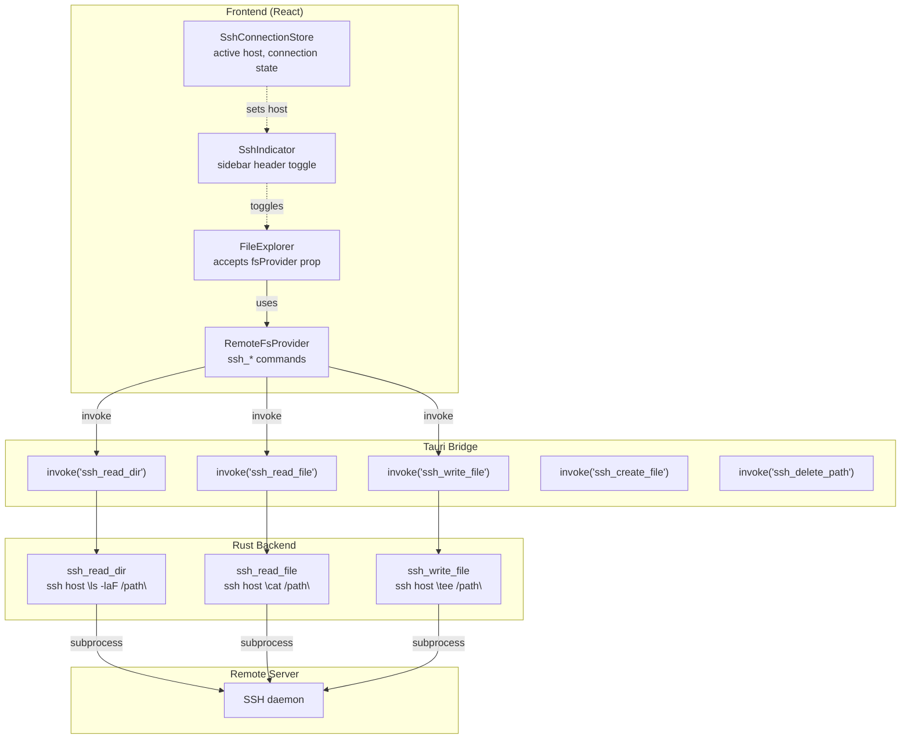

# SSH Remote File Browsing — Design Document

## Goal
When the user is SSH'd into a remote host, the sidebar file explorer can switch to browse the remote server's filesystem.

## Architecture Overview



## Approach: SSH Subprocess

We spawn `ssh host "command"` subprocesses from Rust. This uses the user's existing:
- `~/.ssh/config` settings
- SSH agent / key forwarding
- Known hosts / host key verification
- No new Cargo dependencies needed

Trade-off: Each command opens a new SSH connection. Acceptable for a file browser (operations are on user click, not continuous).

## Rust Commands

New file: `src-tauri/src/remote.rs`

```rust
#[tauri::command]
pub fn ssh_read_dir(host: String, path: String) -> Result<Vec<DirEntry>, String> {
    // ssh host "ls -laF /path" → parse output
}

#[tauri::command]
pub fn ssh_read_file(host: String, path: String) -> Result<String, String> {
    // ssh host "cat /path"
}

#[tauri::command]
pub fn ssh_write_file(host: String, path: String, contents: String) -> Result<(), String> {
    // echo contents | ssh host "tee /path"
}

#[tauri::command]
pub fn ssh_create_file(host: String, path: String) -> Result<(), String> {
    // ssh host "touch /path"
}

#[tauri::command]
pub fn ssh_create_dir(host: String, path: String) -> Result<(), String> {
    // ssh host "mkdir -p /path"
}

#[tauri::command]
pub fn ssh_rename_path(host: String, from: String, to: String) -> Result<(), String> {
    // ssh host "mv /from /to"
}

#[tauri::command]
pub fn ssh_delete_path(host: String, path: String) -> Result<(), String> {
    // ssh host "rm -rf /path"
}

#[tauri::command]
pub fn ssh_home_dir(host: String) -> Result<String, String> {
    // ssh host "echo $HOME"
}
```

## Frontend Changes

### 1. Remote FS Provider (`src/remote/remoteFs.ts`)
Mirrors `fs.ts` API but with `host` as first parameter:

```typescript
export const sshReadDir = (host: string, path: string) => invoke<DirEntry[]>("ssh_read_dir", { host, path });
export const sshReadFile = (host: string, path: string) => invoke<string>("ssh_read_file", { host, path });
// ... etc
```

### 2. SSH Connection Store (`src/remote/store.ts`)
- `activeRemoteHost: string | null` — current SSH host being browsed
- `subscribeSshHost(fn)` / `setSshHost(host | null)`
- Persist last-used host in localStorage

### 3. SSH Auto-Detection
Detect when a terminal is SSH'd via:
- **OSC 7 path**: When path changes to `file://remotehost/...` format
- **Prompt analysis**: Check if `whoami` output differs from local user
- **Manual override**: User clicks "Connect to [host]" button

For initial implementation: **manual toggle** (user clicks host in Remotes view → "Browse files").

### 4. FileExplorer Extension
Add an optional `remoteHost` prop to `FileExplorer`:

```tsx
export function FileExplorer({
  onOpenFile,
  activeFile,
  remoteHost,
}: {
  onOpenFile: (path: string, name: string) => void;
  activeFile?: string | null;
  remoteHost?: string | null;
}) {
  // Use remote fs commands when remoteHost is set, local otherwise
}
```

### 5. SSH Indicator in Sidebar
When browsing a remote host, show a compact header in the sidebar:
- Host name with a globe icon
- "Disconnect" button to switch back to local
- Current remote path (similar to path bar)

## UI Flow

```
1. User opens Remotes sidebar view
2. User sees list of SSH hosts from ~/.ssh/config
3. User clicks a host → dropdown: [Connect terminal] [Browse files]
4. User clicks [Browse files]
5. FileExplorer switches to remote mode for that host
6. Sidebar header shows: 🌐 myserver /home/user  [Disconnect]
7. File tree loads via ssh ls commands
8. User clicks a file → ssh cat → opens in editor (read-only or editable)
9. User clicks Disconnect → switches back to local filesystem
```

## File Open Behavior

When opening a remote file:
1. Read via `ssh cat /path`
2. Open in editor as a virtual/temp file
3. On save: write back via `ssh tee /path`
4. Show a remote indicator in the tab (e.g., `🌐 file.txt` or `[myserver] file.txt`)

## Phase 1 (MVP)
- [ ] Rust SSH commands (`ssh_read_dir`, `ssh_read_file`, `ssh_write_file`, `ssh_delete_path`)
- [ ] Frontend remote fs provider
- [ ] FileExplorer `remoteHost` prop support
- [ ] SSH indicator in sidebar header
- [ ] Remotes view "Browse files" action
- [ ] Read-only remote file viewing

## Phase 2 (Editing)
- [ ] Write back on save (`ssh_write_file`)
- [ ] Create/rename/delete remote files
- [ ] Remote path bar
- [ ] Auto-detect SSH from terminal

## Phase 3 (Polish)
- [ ] SSH connection pooling / SFTP for speed
- [ ] Remote file dirty state indicators
- [ ] Synchronize remote cwd with terminal SSH session
